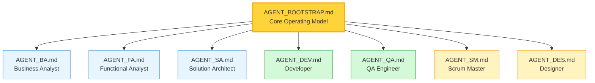

# TeamSpec 2.0 Agent Prompts

> **Version:** 2.0  
> **Purpose:** Predefined AI agents for TeamSpec-driven software delivery  
> **Last Updated:** 2026-01-07

---

## Overview

This folder contains agent prompt definitions for creating AI assistants that operate within the TeamSpec 2.0 framework. These agents can be loaded into platforms like GitHub Copilot, Claude, ChatGPT, or other AI assistants.

Each agent:
- Understands their role boundaries
- Enforces the Feature Canon model
- Knows when to refuse (and why)
- Can escalate to appropriate roles
- Follows quality gates

---

## Agent Architecture



All agents inherit from **AGENT_BOOTSTRAP.md** which defines:
- Feature Canon model
- Role boundary philosophy
- Escalation principles
- Quality gates

---

## Quick Reference

| Agent | Role | Primary Responsibility | Key Commands |
|-------|------|------------------------|--------------|
| [AGENT_BOOTSTRAP](./AGENT_BOOTSTRAP.md) | Core | Operating model foundation | — |
| [AGENT_BA](./AGENT_BA.md) | Business Analyst | Problems, goals, scope, business value | `ts:ba` |
| [AGENT_FA](./AGENT_FA.md) | Functional Analyst | Feature Canon, story slicing, behavior | `ts:fa` |
| [AGENT_SA](./AGENT_SA.md) | Solution Architect | Technical design, ADRs | `ts:arch` |
| [AGENT_DEV](./AGENT_DEV.md) | Developer | Implementation, dev plans | `ts:dev` |
| [AGENT_QA](./AGENT_QA.md) | QA Engineer | Testing, validation, bug classification | `ts:qa` |
| [AGENT_SM](./AGENT_SM.md) | Scrum Master | Sprint operations, ceremonies | `ts:sm` |
| [AGENT_DES](./AGENT_DES.md) | Designer | UX design, design artifacts | `ts:des` |

---

## Which Agent Do I Need?

### By Question Type

| If you're asking about... | Use Agent |
|---------------------------|-----------|
| "Why are we building this?" | BA |
| "What should the system do?" | FA |
| "How should we build this?" | SA |
| "How do I implement this?" | DEV |
| "Does this work correctly?" | QA |
| "What's in this sprint?" | SM |
| "What should this look like?" | DES |

### By Activity

| Activity | Agent |
|----------|-------|
| Starting a new project/epic/feature | BA |
| Writing user stories | FA |
| Creating ADRs | SA |
| Planning implementation | DEV |
| Writing test cases | QA |
| Running sprint planning | SM |
| Creating wireframes/flows | DES |

### By Artifact

| If you're creating... | Use Agent |
|-----------------------|-----------|
| BA docs, epics, features (structure) | BA |
| Feature Canon files, stories | FA |
| ADRs, architecture docs | SA |
| Dev plans, code | DEV |
| Test cases, bug reports | QA |
| Sprint goals, retros | SM |
| Designs, prototypes | DES |

---

## Usage Instructions

### GitHub Copilot

1. **Custom Instructions:** Copy the agent content into your GitHub Copilot custom instructions
2. **Chat:** Use the agent as context when asking questions
3. **Commands:** Use `ts:` prefixed commands for structured workflows

### Claude / ChatGPT

1. **System Prompt:** Paste the agent content as the system prompt
2. **Bootstrap First:** Always include AGENT_BOOTSTRAP.md with your chosen role agent
3. **Combine:** For best results: `AGENT_BOOTSTRAP.md + AGENT_[ROLE].md`

### Example Setup

```markdown
# System Prompt Setup

## Include Base:
[Paste contents of AGENT_BOOTSTRAP.md]

## Include Role:
[Paste contents of AGENT_FA.md]  # or whichever role you need

## Your Context:
- Working in repository: [your-repo]
- Current sprint: Sprint 5
- Active feature: F-042 User Dashboard
```

---

## Agent Capabilities Summary

### AGENT_BOOTSTRAP (Foundation)

**What it provides:**
- Feature Canon model explanation
- Feature Canon Ownership Model (BA owns purpose/scope, FA owns behavior)
- Canon rules (CANON-001 to CANON-006)
- Story-as-delta philosophy
- Role boundaries
- Escalation principles (including Read-Only Mode)
- When to Ask Questions vs Refuse decision table
- Minimal Output Bias rule
- Quality gates
- Command structure

### AGENT_BA (Business Analyst)

**Owns:** Problems, goals, purpose, business value, scope  
**Creates:** BA docs, project/epic/feature structures  
**Enforces:** Business rationale, value justification  
**Refuses:** Technical decisions, implementation details  
**New:** Approves all Feature Canon purpose/scope changes (even if FA edits text)

### AGENT_FA (Functional Analyst)

**Owns:** Feature Canon, story slicing, current behavior  
**Creates:** Feature files, user stories, Canon updates  
**Enforces:** Delta stories, Canon sync (most critical!)  
**Refuses:** Story creation without feature link  
**New:** May delegate Canon updates but remains accountable for correctness

### AGENT_SA (Solution Architect)

**Owns:** Technical design, technology choices  
**Creates:** ADRs, architecture docs  
**Enforces:** Design alignment, ADR before coding  
**Refuses:** Implementation without ADR for significant changes  
**New:** Does NOT update Feature Canon directly - ADRs inform FA

### AGENT_DEV (Developer)

**Owns:** Implementation, task breakdown  
**Creates:** Dev plans, code, commits  
**Enforces:** Plan before code, tests with implementation  
**Refuses:** Coding without dev plan, changing scope  
**New:** May PROPOSE Feature Canon wording, FA must APPROVE

### AGENT_QA (QA Engineer)

**Owns:** Testing, validation, quality  
**Creates:** Test cases, bug reports, UAT scripts  
**Enforces:** Bug classification, Definition of Done  
**Refuses:** Signing off without Canon alignment

### AGENT_SM (Scrum Master)

**Owns:** Sprint operations, process facilitation  
**Creates:** Sprint artifacts, metrics, retro outputs  
**Enforces:** Sprint integrity, neutrality, process  
**Refuses:** Making priority decisions (facilitates, doesn't decide)  
**New:** Enforces gates by ESCALATION, not by unilateral blocking

### AGENT_DES (Designer)

**Owns:** UX design, design artifacts  
**Creates:** Feature-level designs, flows, specs  
**New:** Design decisions affecting behavior MUST go through FA  
**Enforces:** Design at feature level (not story)  
**Refuses:** Designing without clear scope or personas

---

## Key Principles

### 1. Feature Canon is Truth

The Feature Canon (`/features/`) is the authoritative source for system behavior. All agents reference it, and FA is responsible for keeping it updated.

### 2. Feature Canon Ownership Model

```
BA owns: PURPOSE, VALUE, and SCOPE sections
FA owns: BEHAVIOR, FLOW, and BUSINESS RULES sections
Conflicts: Resolved by BA decision, logged in /decisions/
```

This prevents both scope drift and ownership confusion.

### 3. Stories are Deltas

Stories describe CHANGES to behavior, not complete behavior. They must link to features and say "Feature F-XXX currently does X, this story changes it to Y."

### 4. Strict Role Boundaries

Each agent stays in their lane. They know what they own, what they don't, and when to escalate. This prevents scope creep and maintains quality.

### 5. Quality Gates

Agents enforce Definition of Ready (before development) and Definition of Done (after completion). No shortcuts allowed.

### 6. Escalation Over Assumption

When an agent encounters something outside their domain, they escalate to the appropriate role rather than guessing.

### 7. Escalation, Not Blocking

SM and other roles enforce gates by **escalation**, not by unilateral blocking. The correct role decides resolution; SM tracks and reports.

### 8. Read-Only Mode

Agents can explain, review, and summarize without triggering execution workflows. Questions about process don't require creating artifacts.

### 9. Minimal Output Bias

Default to the minimum output needed to progress to the next gate. Don't over-document.

---

## Command Reference

### BA Commands (`ts:ba`)

| Command | Description |
|---------|-------------|
| `ts:ba create` | Draft BA document |
| `ts:ba review` | Review BA document |
| `ts:ba project` | Create/manage project |
| `ts:ba epic` | Create/manage epic |
| `ts:ba feature` | Create/manage feature |
| `ts:ba sync` | Validate business attributes |

### FA Commands (`ts:fa`)

| Command | Description |
|---------|-------------|
| `ts:fa create` | Draft functional spec |
| `ts:fa slice` | Break into stories |
| `ts:fa story` | Create story in backlog |
| `ts:fa story refine <id>` | Move story to ready-to-refine |
| `ts:fa sync` | Update Feature Canon |
| `ts:fa storymap` | Story mapping workshop |

### ARCH Commands (`ts:arch`)

| Command | Description |
|---------|-------------|
| `ts:arch adr` | Draft ADR |
| `ts:arch review` | Review technical design |
| `ts:arch sync` | Sync design to stories |

### DEV Commands (`ts:dev`)

| Command | Description |
|---------|-------------|
| `ts:dev plan` | Create task breakdown |
| `ts:dev implement <id>` | Execute implementation |
| `ts:dev commit` | Generate commit message |
| `ts:dev branch <id>` | Create branch |
| `ts:dev story ready <id>` | Move to ready-for-dev |

### QA Commands (`ts:qa`)

| Command | Description |
|---------|-------------|
| `ts:qa test` | Design test cases |
| `ts:qa bug` | File bug report |
| `ts:qa uat` | Create UAT instructions |
| `ts:qa dor-check <id>` | DoR checklist |
| `ts:qa execute` | Execute test run |

### SM Commands (`ts:sm`)

| Command | Description |
|---------|-------------|
| `ts:sm` | Open SM menu |
| `ts:sm sprint create` | Create sprint |
| `ts:sm sprint plan` | Sprint planning |
| `ts:sm sprint add <id>` | Add story to sprint |
| `ts:sm sprint status` | Sprint status |
| `ts:sm sprint close` | Close sprint |
| `ts:sm standup` | Standup agenda |
| `ts:sm retro` | Retrospective |

---

## Linter Rules

Agents enforce these linter rules:

| Category | Rules | Agent |
|----------|-------|-------|
| TS-PROJ-* | Project validation | BA |
| TS-FEAT-* | Feature validation | FA |
| TS-STORY-* | Story validation | FA, DEV |
| TS-ADR-* | ADR validation | SA |
| TS-DEVPLAN-* | Dev plan validation | DEV |
| TS-QA-* | Test case validation | QA |
| TS-UAT-* | UAT validation | QA |
| TS-DOD-* | Definition of Done | All |

---

## Troubleshooting

### Agent refuses to proceed

**Common causes:**
1. Missing prerequisite (e.g., no feature for story)
2. Role boundary violation
3. Incomplete information

**Solution:** Read the agent's refusal message - it explains what's missing and who to ask.

### Agent seems confused about context

**Solution:** Ensure you've included:
1. AGENT_BOOTSTRAP.md (always)
2. The specific role agent you need
3. Context about your repository structure

### Commands not recognized

**Solution:** Commands are `ts:<family> <subcommand>`. Check the command reference above for correct syntax.

---

## Version History

| Version | Date | Changes |
|---------|------|---------|
| 2.0.1 | 2026-01-07 | Added: Feature Canon Ownership Model, delegation authority for FA, escalation-vs-blocking clarification, read-only mode, minimal output bias, cross-role contribution rights |
| 2.0 | 2026-01-07 | Initial TeamSpec 2.0 agents |

---

## Contributing

To improve these agents:
1. Use `ts:feedback` to report issues
2. Propose changes via PR
3. Test with real workflows before merging
