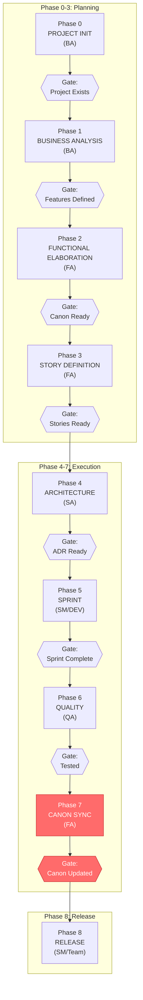
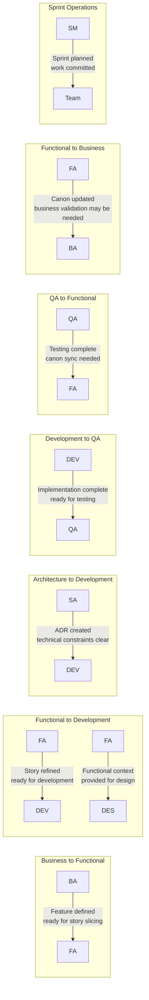
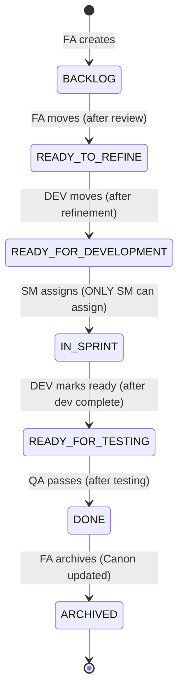

# TeamSpec

> **Product-Canon Operating Model for AI-Assisted Software Delivery**

[](https://www.npmjs.com/package/teamspec)
[](https://opensource.org/licenses/MIT)
[](https://marketplace.visualstudio.com/items?itemName=teamspec.teamspec)

---

> ⚠️ **Work in Progress**: TeamSpec is currently transitioning to version 4.0, which introduces the **Product-Canon** operating model. Not all documentation, agents, and templates are fully updated yet. See the [teamspec_4.0/](teamspec_4.0/) folder for the latest 4.0 planning documents.

---

## What is TeamSpec?

TeamSpec is a **Product-Canon Operating Model** that brings structure and clarity to software delivery. It provides a framework where:

- 📦 **Products** are the long-lived production truth (AS-IS state)
- 📋 **Projects** are time-bound change initiatives (TO-BE state)
- 📚 **Feature Canon** is the single source of truth for system behavior
- 📝 **Stories are deltas** — describing changes, not duplicating documentation  
- 👥 **Roles have clear boundaries** — PO, BA, FA, SA, DEV, QA, SM, DES
- 🤖 **AI agents understand context** — works with GitHub Copilot, Cursor, Claude, and more

```
┌─────────────────────────────────────────────────────────────────────┐
│                         PRODUCTS (AS-IS)                            │
│  Long-lived production truth. Updated only after deployment.        │
│                                                                     │
│  products/                                                          │
│  └── {product-id}/                                                  │
│      ├── product.yml          # Product definition (PO)             │
│      ├── features/            # CANONICAL Feature Canon             │
│      ├── business-analysis/   # Business context                    │
│      ├── solution-designs/    # Technical design                    │
│      └── technical-architecture/  # Architecture decisions          │
└─────────────────────────────────────────────────────────────────────┘
                                   ▲
                                   │ ts:deploy (sync after release)
                                   │
┌─────────────────────────────────────────────────────────────────────┐
│                        PROJECTS (TO-BE)                             │
│  Time-bound change initiatives. Propose changes to products.        │
│                                                                     │
│  projects/                                                          │
│  └── {project-id}/                                                  │
│      ├── project.yml          # Project definition (BA)             │
│      ├── feature-increments/  # PROPOSED changes to Canon           │
│      ├── epics/               # Story containers                    │
│      └── stories/             # Execution deltas                    │
└─────────────────────────────────────────────────────────────────────┘
```

---

## Quick Start

### Option 1: CLI (Recommended)

```bash
# Install globally
npm install -g teamspec

# Initialize in your repository
cd your-repo
teamspec
```

The CLI guides you through:
1. Team profile selection (startup, enterprise, regulated, etc.)
2. Organization and team configuration
3. Development cadence setup (scrum, kanban, scrumban)
4. Initial project creation

### Option 2: GitHub Copilot Integration

TeamSpec works natively with GitHub Copilot through instruction files:

1. **Clone or initialize** TeamSpec in your repository
2. **Ensure GitHub Copilot is active** in your editor
3. **Use TeamSpec commands** in Copilot Chat:

```
ts:ba project          # Create project structure
ts:fa story           # Create delta-based story
ts:dev plan           # Create implementation plan
ts:qa test            # Design test cases
ts:status             # Project health overview
```

GitHub Copilot reads `.github/copilot-instructions.md` and `/agents/` to provide role-based assistance.

### Option 3: Manual Setup

Copy the `.teamspec/` folder from your CLI installation into your repository.

---

## Core Concepts

### Products vs Projects (4.0)

TeamSpec 4.0 introduces a clear separation between **Products** and **Projects**:

| Concept | Purpose | Lifecycle | Owner |
|---------|---------|-----------|-------|
| **Product** | Production truth (AS-IS state) | Permanent | PO |
| **Project** | Change proposal (TO-BE state) | Time-bound | BA |

This solves the "time-pollution problem" where project artifacts contaminate the canonical documentation of production systems.

### Feature Canon

The Feature Canon is the **authoritative source of truth** for what your system does. In TeamSpec 4.0, it lives in `/products/{product-id}/features/` and contains:

- **Feature files** (`f-PRX-NNN-description.md`) — Complete behavior specifications
- **Features index** — Registry of all features
- **Story ledger** — History of completed changes

```markdown
<!-- Example: f-DIT-001-user-authentication.md -->
# f-DIT-001: User Authentication

## Current Behavior
Users can log in with email/password...

## Business Rules
- BR-001: Passwords must be 8+ characters
- BR-002: Lock account after 5 failed attempts
```

### Feature-Increments (4.0)

Projects propose changes to the Feature Canon via **Feature-Increments**. These describe the TO-BE state without modifying the canonical documentation directly:

```markdown
<!-- Example: fi-DIT-001-oauth-login.md -->
# fi-DIT-001: OAuth Login (Feature-Increment)

## Reference
Product Feature: f-DIT-001 (User Authentication)

## Before (Current AS-IS)
Users can only log in with email/password.

## After (Proposed TO-BE)  
Users can also log in with Google OAuth.

## Impact
- Adds new authentication flow
- Requires new OAuth token handling
```

After deployment, the Feature-Increment is synced into the Feature Canon via `ts:deploy`.

### Stories as Deltas

Stories don't duplicate documentation — they describe **changes** within a project:

```markdown
## Before (Current Behavior)
Reference: fi-DIT-001, Section: OAuth Login Flow

## After (New Behavior)  
Users can also log in with Google OAuth.

## Acceptance Criteria
- [ ] Google OAuth button appears on login page
- [ ] Successful Google auth creates/links account
```

### Role Boundaries

| Role | Owns | Does NOT Own | Primary Agent Commands |
|------|------|--------------|------------------------|
| **PO** | Products, product lifecycle, deployment approval | Project execution details | `ts:po product`, `ts:po project`, `ts:po sync` |
| **BA** | Business analysis, decisions, features | Stories, UI, technical design | `ts:ba analysis`, `ts:ba ba-increment` |
| **FA** | Feature Canon, feature-increments, stories, epics | Business intent, implementation | `ts:fa story`, `ts:fa feature`, `ts:fa slice` |
| **SA** | Architecture, technical decisions, solution designs | Requirements, code implementation | `ts:sa ta`, `ts:sa sd` |
| **DEV** | Implementation, dev plans, code quality | Requirements definition, scope | `ts:dev plan`, `ts:dev implement` |
| **QA** | Test cases, bugs, validation | Requirements definition, canon updates | `ts:qa test`, `ts:qa bug` |
| **SM** | Sprints, ceremonies, process, metrics | Prioritization, scope, acceptance | `ts:sm sprint create`, `ts:sm planning` |
| **DES** | UX design, design artifacts, usability | Scope, priority | _(no agent commands defined)_ |

### Role Descriptions and Rules

#### Product Owner (PO)
**Ownership Domain:** Products, Projects, Product Lifecycle, Deployment Approval, Production Truth

| Responsibility | Description |
|----------------|-------------|
| Product Definition | Create and own product structure with unique PRX prefix |
| Deployment Approval | Approve sync from project to product |
| Product Lifecycle | Manage active, deprecated, retired states |
| Project Management | Create projects that target one or more products |

**Hard Rules:**
- PO never modifies Product Canon during active project execution
- PO owns deployment gate — no sync without PO approval
- Product Canon updates require deployment verification
- Products must be registered before projects can target them
- PRX must be unique, 3-4 uppercase letters, and immutable

---

#### Business Analyst (BA)
**Ownership Domain:** Business Intent, Strategic Direction, Feature Definition

| Responsibility | Description |
|----------------|-------------|
| Project Creation | Create and own `/projects/{project-id}/` structure |
| Business Analysis | Perform analysis of business processes |
| Feature Definition | Define and prioritize Features (implementation-agnostic) |
| Decision Logs | Maintain `/decisions/` with business decisions |

**Hard Rules:**
- BA never writes stories (FA responsibility)
- BA never defines system behavior details
- BA never approves technical feasibility
- BA owns "what and why", never "how"
- All feature changes require decision log entry

---

#### Functional Analyst (FA)
**Ownership Domain:** System Behavior, Story Definition, Feature Canon Synchronization

| Responsibility | Description |
|----------------|-------------|
| Story Definition | Define Stories as deltas to Features |
| Acceptance Criteria | Write ACs aligned to Feature Canon |
| Feature Canon Sync | Update Feature Canon when behavior changes |
| Behavior Validation | Validate behavior with users and SMEs |

**Hard Rules:**
- All behavior must trace to BA analysis or stakeholder validation
- FA is the Feature Canon synchronizer
- Reject stories that restate features instead of deltas
- Stories must link to ≥1 feature
- Feature Canon updated before story marked Done

**Critical Gate:** FA is responsible for the most critical gate — ensuring Feature Canon reflects implemented behavior.

---

#### Solution Architect (SA)
**Ownership Domain:** Technical Direction, Architecture Decisions, System Structure

| Responsibility | Description |
|----------------|-------------|
| ADR Ownership | Create and maintain ADRs per Feature |
| Technical Approach | Define high-level technical approach |
| Cross-Feature Impact | Assess cross-feature and irreversible decisions |

**Hard Rules:**
- ADRs link to features and decisions
- High-level decisions only, not code-level
- Technical feasibility assessment, not requirement changes
- ADR required before dev work on architecture-impacting changes

---

#### Developer (DEV)
**Ownership Domain:** Implementation, Task Planning, Code Delivery

| Responsibility | Description |
|----------------|-------------|
| Dev Plans | Create detailed dev plans per story |
| Implementation | Implement stories per Feature Canon and ADR |
| Reviewable Iterations | Deliver work in reviewable chunks |
| DoD Completion | Mark stories ready for testing when DoD met |

**Hard Rules:**
- DEV cannot redefine scope
- DEV cannot change feature behavior silently
- DEV must stop and escalate if ADR or Feature Canon is unclear
- Dev plan required before implementation starts
- All tasks must be reviewable

---

#### QA Engineer (QA)
**Ownership Domain:** Verification, Test Design, Quality Assurance

| Responsibility | Description |
|----------------|-------------|
| Story Testing | Test stories against Acceptance Criteria |
| Feature Test Cases | Create Feature-level test cases (canonical) |
| Bug Classification | Classify bugs vs documentation gaps |
| UAT Packs | Prepare UAT packs per persona |

**Hard Rules:**
- QA never updates Feature Canon directly
- QA flags mismatches → FA decides
- Tests are canonical (feature-level), not story-specific
- Bugs must be classified (implementation vs. canon vs. undocumented)

---

#### Designer (DES)
**Ownership Domain:** User Experience, Design Artifacts, Interaction Design

| Responsibility | Description |
|----------------|-------------|
| UX Design | Create UX designs at Feature level |
| Design Consistency | Ensure design consistency and usability |
| User Validation | Validate designs with real users |

**Hard Rules:**
- Designs are feature canon, not story artifacts
- Designers work with personas from BA analysis
- Refuse to design if feature scope is unclear
- Refuse to design if personas are missing

---

#### Scrum Master (SM)
**Ownership Domain:** Sprint Operations, Facilitation, Metrics

| Responsibility | Description |
|----------------|-------------|
| Sprint Management | Create and manage sprints |
| Sprint Planning | Facilitate sprint planning |
| Progress Tracking | Track progress and metrics |
| Ceremony Facilitation | Run standups, reviews, retros |

**Hard Rules:**
- SM does not prioritize
- SM does not change scope
- SM does not accept work
- SM is metrics-driven and neutral
- Only SM can assign stories to sprints

---

### Main Workflow

The TeamSpec workflow follows a structured order of operations with explicit role handoffs and quality gates:



### Role Handoffs



### Story State Machine



---

## Project Structure

After initialization, your repository will have:

```
your-repo/
├── .teamspec/                      # Framework core
│   ├── agents/                     # Role-specific agents (+ AGENT_PO.md)
│   ├── templates/                  # Document templates
│   ├── definitions/                # DoR/DoD checklists
│   ├── profiles/                   # Profile overlays
│   └── context/
│       └── team.yml                # Team configuration
│
├── products/                       # 📦 PRODUCTION TRUTH (4.0)
│   ├── products-index.md           # Product registry
│   └── {product-id}/               # e.g., checkout-system/
│       ├── product.yml             # Product metadata (PO owns)
│       ├── features/               # 📚 CANONICAL Feature Canon
│       │   ├── f-PRX-NNN-*.md      # Feature files
│       │   ├── features-index.md   # Feature registry
│       │   └── story-ledger.md     # Story history
│       ├── business-analysis/      # Business context
│       ├── solution-designs/       # Technical design
│       ├── technical-architecture/ # Architecture decisions
│       └── decisions/              # Product decisions
│
├── projects/                       # 📋 CHANGE PROPOSALS
│   ├── projects-index.md           # Project registry
│   └── {project-id}/               # e.g., q1-2026-oauth/
│       ├── project.yml             # Project metadata (BA owns)
│       ├── feature-increments/     # 📝 Proposed changes to Canon
│       │   ├── fi-PRX-NNN-*.md     # Feature-increment files
│       │   └── increments-index.md # Increment registry
│       ├── epics/                  # Epic definitions
│       ├── stories/                # 📝 Stories (deltas)
│       │   ├── backlog/            # New stories
│       │   ├── ready-to-refine/    # For refinement
│       │   └── ready-to-develop/   # Sprint-ready
│       ├── technical-architecture-increments/  # Project ADRs
│       ├── decisions/              # Project decisions
│       ├── dev-plans/              # Implementation plans
│       ├── qa/test-cases/          # Test documentation
│       └── sprints/                # Sprint management
```

---

## AI Agent Integration

### GitHub Copilot (Recommended)

TeamSpec provides native GitHub Copilot integration through instruction files:

**In Copilot Chat:**
```
ts:po product                 # Create/manage products (4.0)
ts:po project                 # Create/manage projects
ts:fa story                   # Create delta-based story
ts:dev plan                   # Create implementation plan
ts:qa test                    # Design test cases
ts:po sync                    # Sync increments to Canon (4.0)
ts:status                     # Project health overview
ts:agent fix                  # Auto-fix lint errors
```

**How it works:**
1. GitHub Copilot reads `.github/copilot-instructions.md`
2. Loads role-specific agents from `/agents/` on demand
3. Applies team context from `.teamspec/context/team.yml`
4. Provides role-aware assistance with quality gates

### Other AI Assistants (Claude, ChatGPT, Cursor)

Use the agent prompts in `/agents/`:

1. Copy `AGENT_BOOTSTRAP.md` as system context
2. Add the role-specific agent (e.g., `AGENT_FA.md`, `AGENT_PO.md`)
3. Include your team context from `.teamspec/context/team.yml`

---

## Documentation

| Document | Purpose |
|----------|---------|
| [CLI README](cli/README.md) | CLI installation and commands |
| [Agents Guide](agents/README.md) | Role-based AI agent prompts |
| [Templates Guide](templates/README.md) | Document templates reference |
| [Roles & Responsibilities](roles/ROLES_AND_RESPONSIBILITIES.md) | Role boundaries and ownership |
| [Project Structure Reference](PROJECT_STRUCTURE_REFERENCE.md) | Detailed folder structure |
| **TeamSpec 4.0 Planning** | |
| [4.0 Overview](teamspec_4.0/README.md) | Product-Canon operating model |
| [4.0 Folder Structure](teamspec_4.0/FOLDER_STRUCTURE.md) | Complete 4.0 folder structure |
| [4.0 Artifact Glossary](teamspec_4.0/ARTIFACT_GLOSSARY.md) | All artifact types and naming |
| [4.0 Migration Guide](teamspec_4.0/07-MIGRATION-GUIDE.md) | Migrating from 2.0 to 4.0 |

---

## Command Reference

### CLI Commands

```bash
teamspec                  # Interactive setup
teamspec --profile X      # Use specific profile
teamspec lint             # Validate project structure
teamspec lint --project X # Lint specific project
teamspec update           # Update TeamSpec core files
teamspec migrate          # Analyze 2.0 → 4.0 migration (dry-run)
teamspec migrate --fix    # Execute 2.0 → 4.0 migration
teamspec generate-prompts # Generate GitHub Copilot prompt files
```

### Agent Commands (used in AI assistants like GitHub Copilot, Cursor, Claude)

| Command | Description |
|---------|-------------|
| `ts:po product` | Create/manage products (4.0) |
| `ts:po project` | Create/manage projects |
| `ts:po sync` | Sync project increments to Product Canon |
| `ts:ba analysis` | Create business analysis documents |
| `ts:ba ba-increment` | Create BA increment in project |
| `ts:fa feature` | Create a feature in Product Canon |
| `ts:fa feature-increment` | Create a Feature-Increment |
| `ts:fa story` | Create delta-based stories |
| `ts:fa slice` | Slice epic into stories |
| `ts:sa ta` | Create Technical Architecture document |
| `ts:sa sd` | Create Solution Design document |
| `ts:dev plan` | Create implementation plans |
| `ts:dev implement` | Start implementation workflow |
| `ts:qa test` | Design test cases |
| `ts:qa bug` | File bug reports |
| `ts:sm sprint create` | Create new sprint |
| `ts:sm planning` | Sprint planning facilitation |
| `ts:status` | Project health overview |
| `ts:agent fix` | Auto-fix lint errors |

---

## Profiles

TeamSpec supports different team profiles:

| Profile | Characteristics |
|---------|-----------------|
| **startup** | Minimal process, fast iteration |
| **enterprise** | Full governance, compliance |
| **regulated** | Audit trails, formal approvals |
| **agency** | Multi-client, project-based |
| **opensource** | Community-driven, RFC-style |

Select during `teamspec init` or with `--profile`.

---

## Quality Gates

### Definition of Ready (DoR)

Before a story enters development:
- [ ] Linked to Epic (4.0 requirement)
- [ ] References Feature-Increment (TO-BE state)
- [ ] Before/After delta clearly described
- [ ] Acceptance Criteria are testable
- [ ] Estimate assigned

### Definition of Done (DoD)

Before a story is marked complete:
- [ ] All AC verified
- [ ] Code reviewed and merged
- [ ] Tests passing
- [ ] **Feature-Increment updated** (if behavior changed)

### Deployment Gate (4.0)

Before project completion:
- [ ] All Feature-Increments reviewed
- [ ] `ts:deploy` executed to sync to Canon
- [ ] Feature Canon updated with approved changes

---

## Contributing

We welcome contributions! Please see our [Contributing Guide](CONTRIBUTING.md) for details.

### Development Setup

```bash
# Clone the repository
git clone https://github.com/teamspec/teamspec.git
cd teamspec

# CLI development
cd cli
npm install
npm test

# VS Code extension development
cd vscode-extension
npm install
npm run compile
```

---

## License

MIT License — see [LICENSE](LICENSE) for details.

---

## Links

- 📦 [npm package](https://www.npmjs.com/package/teamspec)
- 🐛 [Issue tracker](https://github.com/teamspec/teamspec/issues)
- 📖 [Documentation](https://github.com/teamspec/teamspec/wiki)

---

<p align="center">
  <strong>Built for teams who believe documentation should be a living asset, not a burden.</strong>
</p>
