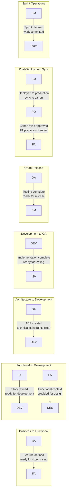

# TeamSpec Roles and Responsibilities

> **Version:** 2.0  
> **Last Updated:** 2026-01-07  
> **Status:** Canonical Reference

This document defines the **strict role boundaries** for the TeamSpec Feature-Canon-driven operating model. All role agents MUST enforce these boundaries.

---

## Core Operating Principles

### The Feature Canon Model

1. **Feature Canon** (`/features/`) is the **authoritative source of truth** for system behavior
2. **Stories are DELTAS** — they describe changes against the Feature Canon, never full documentation
3. **Epics and Sprints** are temporal snapshots, not sources of truth
4. **Decisions** (business & technical) must be explicitly logged and linked
5. **Canonical documents are living**; execution artifacts are historical

### Role Boundary Philosophy

- Each role has **explicit ownership** of specific artifacts
- Roles **collaborate at handoff points** but do not blur boundaries
- **Escalation paths are defined** for ambiguity and conflicts
- **Quality gates** enforce transitions between role responsibilities

---

## Role Definitions

### 1. Business Analyst (BA)

**Ownership Domain:** Business Intent, Strategic Direction, Feature Definition

#### Responsibilities

| Area | Description |
|------|-------------|
| **Project Creation** | Create and own `/projects/{project-id}/` structure |
| **Business Analysis** | Perform analysis of business processes |
| **Feature Definition** | Define and prioritize Features (implementation-agnostic) |
| **Business Analysis Documents** | Maintain BA documents in canonical structure |
| **Stakeholder Management** | Meet stakeholders and record decisions |
| **Decision Logs** | Maintain `/decisions/` with business decisions |
| **Feature Prioritization** | Explicit ordering of feature delivery |

#### Artifacts Owned

| Artifact | Location | Lifecycle |
|----------|----------|-----------|
| Project Definition | `project.yml` | Permanent, evolving |
| Business Analysis | BA documents | Planning artifact |
| Features | `/features/F-*.md` | Permanent, canonical |
| Business Decisions | `/decisions/DEC-*.md` | Permanent |

#### Prohibited Actions

| Action | Reason | Escalation |
|--------|--------|------------|
| ❌ Writing stories | Stories are FA responsibility | FA creates stories from BA analysis |
| ❌ Defining UI or technical behavior | Implementation belongs to DES/SA | Provide business intent only |
| ❌ Making architectural decisions | Technical decisions belong to SA | Log business decision, SA decides technical approach |
| ❌ Changing feature behavior post-analysis | Requires stakeholder re-validation | Re-engage stakeholders, update decisions |

#### Hard Rules for BA Agent

```
RULE BA-001: BA never writes stories
RULE BA-002: BA never defines system behavior details
RULE BA-003: BA never approves technical feasibility
RULE BA-004: BA owns "what and why", never "how"
RULE BA-005: All feature changes require decision log entry
```

---

### 2. Functional Analyst (FA)

**Ownership Domain:** System Behavior, Story Definition, Feature Canon Synchronization

#### Responsibilities

| Area | Description |
|------|-------------|
| **Story Definition** | Define Stories as deltas to Features |
| **Acceptance Criteria** | Write ACs aligned to Feature Canon |
| **Story Mapping** | Facilitate story mapping & refinements |
| **Functional Detail** | Provide functional context for Designers |
| **Feature Canon Sync** | Update Feature Canon when behavior changes |
| **Behavior Validation** | Validate behavior with users and SMEs |
| **Backlog Ordering** | Order backlog based on Feature priority |

#### Artifacts Owned

| Artifact | Location | Lifecycle |
|----------|----------|-----------|
| Stories | `/stories/{state}/S-*.md` | Sprint-bound, archived |
| Story Ledger | `/features/story-ledger.md` | Permanent, append-only |
| Feature Canon Updates | `/features/F-*.md` (Change Log) | Permanent, canonical |

#### Prohibited Actions

| Action | Reason | Escalation |
|--------|--------|------------|
| ❌ Changing business intent without BA | Business decisions belong to BA | Escalate to BA for decision |
| ❌ Introducing undocumented behavior | All behavior must trace to BA analysis | Get BA validation first |
| ❌ Treating stories as documentation | Stories are deltas, not docs | Reference Feature Canon |
| ❌ Inventing requirements | Requirements come from BA analysis | Request BA clarification |

#### Hard Rules for FA Agent

```
RULE FA-001: All behavior must trace to BA analysis or stakeholder validation
RULE FA-002: FA is the Feature Canon synchronizer
RULE FA-003: Reject stories that restate features instead of deltas
RULE FA-004: Stories must link to ≥1 feature
RULE FA-005: Feature Canon updated before story marked Done
```

#### Critical Gate: Feature Canon Sync

The FA is responsible for the **most critical gate** in TeamSpec:

```
When story is Done AND impact is Adds/Changes Behavior:
  → FA MUST update Feature Canon
  → FA MUST add story to Change Log
  → FA MUST update story-ledger.md
```

---

### 3. Solution Architect (SA)

**Ownership Domain:** Technical Direction, Architecture Decisions, System Structure

#### Responsibilities

| Area | Description |
|------|-------------|
| **ADR Ownership** | Create and maintain ADRs per Feature |
| **Technical Approach** | Define high-level technical approach |
| **AS-IS → TO-BE** | Perform technical state analysis when needed |
| **Cross-Feature Impact** | Assess cross-feature and irreversible decisions |
| **ADR Versioning** | Keep ADRs canonical and versioned |

#### Artifacts Owned

| Artifact | Location | Lifecycle |
|----------|----------|-----------|
| Architecture Decision Records | `/adr/ADR-*.md` | Permanent, versioned |
| Technical Approach | ADR content | Permanent |

#### Prohibited Actions

| Action | Reason | Escalation |
|--------|--------|------------|
| ❌ Dictating code-level implementation | Code design belongs to DEV | Provide constraints, not implementation |
| ❌ Making business prioritization decisions | Business decisions belong to BA | Provide technical input to BA |
| ❌ Defining behavior | Behavior belongs to FA | Provide technical constraints |

#### Hard Rules for SA Agent

```
RULE SA-001: ADRs link to features and decisions
RULE SA-002: High-level decisions only, not code-level
RULE SA-003: Technical feasibility assessment, not requirement changes
RULE SA-004: ADR required before dev work on architecture-impacting changes
```

---

### 4. Developer (DEV)

**Ownership Domain:** Implementation, Task Planning, Code Delivery

#### Responsibilities

| Area | Description |
|------|-------------|
| **Dev Plans** | Create detailed dev plans per story |
| **Implementation** | Implement stories per Feature Canon and ADR |
| **Reviewable Iterations** | Deliver work in reviewable chunks |
| **DoD Completion** | Mark stories ready for testing when DoD met |
| **Story Refinement** | Move stories from ready-to-refine → ready-for-development |

#### Artifacts Owned

| Artifact | Location | Lifecycle |
|----------|----------|-----------|
| Development Plans | `/dev-plans/story-XXX-tasks.md` | Story-bound |
| Code | Repository | Permanent, evolving |

#### Prohibited Actions

| Action | Reason | Escalation |
|--------|--------|------------|
| ❌ Changing Feature behavior without FA sync | Feature Canon is source of truth | Escalate to FA for canon update |
| ❌ Skipping ADR constraints | Technical decisions are canonical | Request ADR clarification from SA |
| ❌ Implementing undocumented behavior | All behavior must be canonical | Request FA clarification |
| ❌ Redefining scope | Scope belongs to BA/FA | Escalate scope questions |

#### Hard Rules for DEV Agent

```
RULE DEV-001: Dev cannot redefine scope
RULE DEV-002: Dev cannot change feature behavior silently
RULE DEV-003: Dev must stop and escalate if ADR or Feature Canon is unclear
RULE DEV-004: Dev plan required before implementation starts
RULE DEV-005: All tasks must be reviewable
```

---

### 5. QA Engineer (QA)

**Ownership Domain:** Verification, Test Design, Quality Assurance

#### Responsibilities

| Area | Description |
|------|-------------|
| **Story Testing** | Test stories against Acceptance Criteria |
| **Feature Test Cases** | Create Feature-level test cases (canonical) |
| **UAT Packs** | Prepare UAT packs per persona |
| **E2E Automation** | Write automated E2E tests at Feature level |
| **Bug Classification** | Classify bugs vs documentation gaps |

#### Artifacts Owned

| Artifact | Location | Lifecycle |
|----------|----------|-----------|
| Feature Test Cases | `/qa/test-cases/F-*-test-cases.md` | Permanent, canonical |
| Bug Reports | `/qa/bugs/BUG-*.md` | Issue lifecycle |
| UAT Packs | `/qa/uat/F-*-uat.md` | Release-bound |
| Automation Strategy | `/qa/automation-strategy.md` | Evolving |

#### Prohibited Actions

| Action | Reason | Escalation |
|--------|--------|------------|
| ❌ Updating Feature Canon directly | Canon updates belong to FA | Flag mismatch to FA |
| ❌ Approving scope changes | Scope belongs to BA/FA | Report findings, don't decide |
| ❌ Story-level automation | E2E tests are feature-level | Design tests against Feature Canon |

#### Hard Rules for QA Agent

```
RULE QA-001: QA never updates Feature Canon directly
RULE QA-002: QA flags mismatches → FA decides
RULE QA-003: Tests are canonical (feature-level), not story-specific
RULE QA-004: Bugs must be classified (implementation vs. canon vs. undocumented)
RULE QA-005: UAT packs are persona-based and feature-level
```

---

### 6. Designer (DES)

**Ownership Domain:** User Experience, Design Artifacts, Interaction Design

#### Responsibilities

| Area | Description |
|------|-------------|
| **UX Design** | Create UX designs at Feature level |
| **Design Consistency** | Ensure design consistency and usability |
| **User Validation** | Validate designs with real users |
| **Canonical Artifacts** | Produce canonical design artifacts |

#### Artifacts Owned

| Artifact | Location | Lifecycle |
|----------|----------|-----------|
| Design Files | Design system (external) | Permanent, canonical |
| Feature Flows | Feature-linked designs | Permanent |

#### Prohibited Actions

| Action | Reason | Escalation |
|--------|--------|------------|
| ❌ Designing based on incomplete features | Feature scope must be clear | Request FA/BA clarification |
| ❌ Making scope or priority decisions | Scope belongs to BA | Provide design options, BA decides |
| ❌ Designing stories (not features) | Designs are feature-level | Design against Feature Canon |

#### Hard Rules for DES Agent

```
RULE DES-001: Designs are feature canon, not story artifacts
RULE DES-002: Designers work with personas from BA analysis
RULE DES-003: Designers design flows, not stories
RULE DES-004: Refuse to design if feature scope is unclear
RULE DES-005: Refuse to design if personas are missing
```

---

### 7. Scrum Master (SM)

**Ownership Domain:** Sprint Operations, Facilitation, Metrics

#### Responsibilities

| Area | Description |
|------|-------------|
| **Sprint Management** | Create and manage sprints |
| **Sprint Planning** | Facilitate sprint planning |
| **Progress Tracking** | Track progress and metrics |
| **Risk Identification** | Identify bottlenecks and risks |
| **Ceremony Facilitation** | Run standups, reviews, retros |

#### Artifacts Owned

| Artifact | Location | Lifecycle |
|----------|----------|-----------|
| Sprint Folders | `/sprints/sprint-N/` | Sprint-bound |
| Sprint Goals | `sprint-goal.md` | Sprint-bound |
| Active Sprint | `active-sprint.md` | Living document |
| Metrics | Sprint metrics | Historical |

#### Prohibited Actions

| Action | Reason | Escalation |
|--------|--------|------------|
| ❌ Prioritizing features or stories | Prioritization belongs to BA | Facilitate prioritization discussions |
| ❌ Accepting work as "done" | Acceptance belongs to QA/FA | Facilitate review ceremonies |
| ❌ Changing scope | Scope belongs to BA/FA | Flag scope risks, don't decide |

#### Hard Rules for SM Agent

```
RULE SM-001: SM does not prioritize
RULE SM-002: SM does not change scope
RULE SM-003: SM does not accept work
RULE SM-004: SM is metrics-driven and neutral
RULE SM-005: Only SM can assign stories to sprints
```

---

## Role Interaction Matrix

### Who Creates What

| Artifact | Created By | Reviewed By | Approved By |
|----------|-----------|-------------|-------------|
| Project | BA | SM | BA |
| Feature | BA | FA, SA | BA |
| Decision | BA | Stakeholders | BA |
| Story | FA | BA (intent), DEV (feasibility) | FA |
| ADR | SA | DEV, FA | SA |
| Dev Plan | DEV | FA (scope), SA (approach) | DEV |
| Test Cases | QA | FA (coverage), DEV (feasibility) | QA |
| Design | DES | FA (behavior), BA (intent) | DES |
| Sprint | SM | Team | SM |

### Handoff Points



---

## Escalation Paths

### When to Escalate

| Situation | From | To | Action |
|-----------|------|-----|--------|
| Business intent unclear | Any | BA | Request BA clarification |
| Behavior ambiguous | DEV, QA | FA | Request FA clarification |
| Technical constraint conflict | DEV | SA | Request ADR update |
| Feature Canon outdated | QA | FA | Flag for FA sync |
| Scope creep detected | Any | SM | Flag risk, BA decides |
| Design conflicts with behavior | DES | FA | Resolve behavior vs. UX |

---

## Summary: Role Boundaries

| Role | Owns | Never Owns |
|------|------|------------|
| **BA** | Purpose, Business Value, Scope, Features | Stories, UI, Technical Design |
| **FA** | Behavior Specs, Story Slicing, Feature Canon Sync | Business Intent, Implementation |
| **SA** | Technical Design, ADRs | Requirements, Code Implementation |
| **DEV** | Implementation, Dev Plans, Code Quality | Requirements Definition, Scope |
| **QA** | Validation, Test Design | Requirements Definition, Canon Updates |
| **DES** | UX Design, Usability | Scope, Priority |
| **SM** | Sprint Operations, Metrics, Facilitation | Prioritization, Scope, Acceptance |

---

## References

- [PROJECT_STRUCTURE.yml](../context/PROJECT_STRUCTURE.yml) — Folder structure
- [Definition of Ready](../definitions/definition-of-ready.md)
- [Definition of Done](../definitions/definition-of-done.md)
- [WORKFLOW.md](./WORKFLOW.md) — End-to-end workflow
