# TeamSpec Workflow & Order of Operations

> **Version:** 2.0  
> **Last Updated:** 2026-01-11  
> **Status:** Canonical Reference

This document defines the **end-to-end workflow** for TeamSpec, including explicit role handoffs and hard gates that enforce the Feature Canon operating model.

---

## Workflow Overview


> **Note:** Canon Sync (Phase 8) occurs **after deployment** to production. The Product Canon should only be updated to reflect behavior that is actually deployed and running. This is triggered via `ts:po sync` when the increment is verified in production.

---

## Phase 0 — Project Initialization

**Primary Role:** BA  
**Supporting Roles:** SM (light), SA (optional)  
**Frequency:** One-time per project

### Purpose

Establish the project structure, define context, and agree on operating rules.

### Steps

| Step | Action | Owner | Artifact |
|------|--------|-------|----------|
| 0.1 | Create project folder | BA | `/projects/{project-id}/` |
| 0.2 | Fill project.yml | BA | `project.yml` |
| 0.3 | Register in projects-index | BA | `projects-index.md` |
| 0.4 | Define project context | BA | README.md / project.yml |
| 0.5 | Agree on TeamSpec rules | BA + Team | Team agreement |

### Gate: Project Exists

**Must be TRUE before proceeding:**

- [ ] Project folder exists at `/projects/{project-id}/`
- [ ] `project.yml` contains minimum required fields
- [ ] Project registered in `projects-index.md`
- [ ] Roles assigned
- [ ] Team agrees on Feature Canon operating model

**Linter Rules:** `TS-PROJ-001`, `TS-PROJ-002`

### Handoff

```
BA → Team: Project structure ready
         Team may now begin business analysis
```

---

## Phase 1 — Business Analysis & Feature Definition

**Primary Role:** BA  
**Supporting Roles:** FA (observer), DES (optional), SA (observer)  
**Frequency:** Per feature or feature set

### Purpose

Understand the business domain, define features, and establish priorities.

### Steps

| Step | Action | Owner | Artifact |
|------|--------|-------|----------|
| 1.1 | Perform business analysis | BA | BA documents |
| 1.2 | Document business process | BA | Process maps |
| 1.3 | Capture As-Is / To-Be (business level) | BA | BA documents |
| 1.4 | Identify users, personas, pain points | BA | Persona definitions |
| 1.5 | Create feature files | BA | `/features/F-XXX.md` |
| 1.6 | Log decisions | BA | `/decisions/DEC-XXX.md` |
| 1.7 | Prioritize features | BA | Feature priority in index |

### Feature Canon Rules (Phase 1)

Each feature file must contain:

- **Purpose** — Why this feature exists
- **Scope** — What's in and out
- **Actors/Personas** — Who uses it
- **Main Flow** — High-level behavior (implementation-agnostic)
- **Business Rules** — BR-XXX rules
- **Edge Cases** — Known exceptions
- **Non-Goals** — What's explicitly excluded
- **Change Log** — Empty (no changes yet)

### Gate: Features Defined

**Must be TRUE before proceeding:**

- [ ] Business Analysis document exists
- [ ] Feature Canon skeleton exists (`/features/F-*.md`)
- [ ] All decisions logged (`/decisions/DEC-*.md`)
- [ ] Feature priority established
- [ ] Features are implementation-agnostic

**Linter Rules:** `TS-FEAT-001`, `TS-FEAT-002`, `TS-FEAT-003`, `TS-DEC-001`

### Hard Rule

🚫 **No stories may be written before this gate passes**

### Handoff

```
BA → FA: Feature Canon ready for functional elaboration
        FA may now begin behavior discovery
```

---

## Phase 2 — Functional Elaboration

**Primary Role:** FA  
**Supporting Roles:** BA (intent validation), DES (UX input), SA (technical constraints), Users/SMEs  
**Frequency:** Per feature or feature set

### Purpose

Translate business intent into detailed system behavior.

### Steps

| Step | Action | Owner | Artifact |
|------|--------|-------|----------|
| 2.1 | Story mapping workshop | FA + Team | Understanding (not commitment) |
| 2.2 | Discover behavior, flows, edge cases | FA | Notes, flow diagrams |
| 2.3 | Perform functional analysis | FA | Functional notes |
| 2.4 | Identify rules, scenarios, variants | FA | Rule catalog |
| 2.5 | Validate with users/SMEs | FA | Validation sign-off |
| 2.6 | Update Feature Canon (if needed) | FA | `/features/F-XXX.md` |
| 2.7 | Add business rules (BR-XXX) | FA | Feature Canon sections |

### Feature Canon Updates (Phase 2)

FA may update Feature Canon to:

- Clarify behavior descriptions
- Add business rules (BR-XXX)
- Add edge cases
- Refine flows

FA may **NOT**:

- Change business intent (escalate to BA)
- Add undocumented behavior (validate first)

### Gate: Canon Ready for Story Slicing

**Must be TRUE before proceeding:**

- [ ] Feature Canon reflects intended behavior
- [ ] Stakeholder validation completed
- [ ] No undocumented assumptions
- [ ] Business rules are explicit (BR-XXX)

**Linter Rules:** `TS-FEAT-002` (updated sections)

### Handoff

```
FA → FA: Features ready to be sliced into stories
        FA may now create stories
```

---

## Phase 3 — Story Definition

**Primary Role:** FA  
**Supporting Roles:** BA (intent), DES (UX), SA (constraints)  
**Frequency:** Per story

### Purpose

Create stories as deltas against the Feature Canon.

### Steps

| Step | Action | Owner | Artifact |
|------|--------|-------|----------|
| 3.1 | Create story files | FA | `/stories/backlog/S-XXX.md` |
| 3.2 | Link to ≥1 feature | FA | Story metadata |
| 3.3 | Define delta (Before/After) | FA | Story content |
| 3.4 | Write Acceptance Criteria | FA | Story AC section |
| 3.5 | Attach UX inputs (if applicable) | FA + DES | Design links |
| 3.6 | Complete DoR checklist | FA | Story DoR section |
| 3.7 | Move to ready-to-refine | FA | `/stories/ready-to-refine/` |

### Story Delta Rules

Every story MUST:

- Link to ≥1 feature
- Describe delta ONLY (Before → After)
- NEVER restate full feature behavior
- Reference Feature Canon rules (BR-XXX)

### Gate: Story Ready for Development

**Must be TRUE before proceeding:**

- [ ] Story links to ≥1 feature
- [ ] Story describes delta only
- [ ] Acceptance Criteria are testable
- [ ] Impact type marked (Adds/Changes/Fixes/Removes)
- [ ] Dependencies identified
- [ ] Sized appropriately
- [ ] DoR checklist complete

**Linter Rules:** `TS-STORY-001`, `TS-STORY-002`, `TS-STORY-003`, `TS-STORY-005`

### Hard Rule

🚫 **Only SM can move stories into a sprint**

### Handoff

```
FA → DEV: Story refined, in ready-for-development
          DEV may now refine further
FA → SM: Story ready for sprint planning
         SM may now include in sprint
```

---

## Phase 4 — Architectural Analysis

**Primary Role:** SA  
**Supporting Roles:** DEV (implementation), FA (behavior)  
**Frequency:** Per feature or significant change

### Purpose

Define technical approach and document architectural decisions.

### When Required

- New feature with technical complexity
- Cross-feature changes
- Irreversible decisions
- Integration impact
- Performance/scale requirements

### Steps

| Step | Action | Owner | Artifact |
|------|--------|-------|----------|
| 4.1 | Create/update ADR | SA | `/adr/ADR-XXX.md` |
| 4.2 | Perform AS-IS → TO-BE analysis | SA | ADR content |
| 4.3 | Assess risks & constraints | SA | ADR sections |
| 4.4 | Link ADR to Feature & Epic | SA | ADR metadata |
| 4.5 | Review with DEV team | SA | Technical review |

### ADR Requirements

Each ADR must contain:

- Problem statement
- Context & constraints
- Decision & rationale
- Consequences (positive/negative)
- Mitigations
- Links to Features and Decisions

### Gate: ADR Ready

**Must be TRUE before proceeding (when ADR required):**

- [ ] ADR exists and is complete
- [ ] ADR links to feature(s)
- [ ] Technical direction is clear
- [ ] DEV team understands constraints

**Linter Rules:** `TS-ADR-001`, `TS-ADR-002`

### Hard Rule

🚫 **No dev work on architecture-impacting changes without ADR clarity**

### Handoff

```
SA → DEV: ADR ready, technical direction clear
          DEV may now create dev plan
```

---

## Phase 5 — Sprint Planning & Execution

### 5.1 Sprint Planning

**Primary Role:** SM  
**Supporting Roles:** Entire team  
**Frequency:** Per sprint

#### Steps

| Step | Action | Owner | Artifact |
|------|--------|-------|----------|
| 5.1.1 | Select Ready stories only | SM + Team | Sprint backlog |
| 5.1.2 | Check capacity | SM | Capacity calculation |
| 5.1.3 | Define sprint goal | SM + Team | Sprint goal |
| 5.1.4 | Create sprint folder | SM | `/sprints/sprint-N/` |
| 5.1.5 | Update active-sprint.md | SM | `active-sprint.md` |

#### Gate: Sprint Committed

- [ ] Only Ready stories selected
- [ ] Capacity validated
- [ ] Sprint goal defined
- [ ] Sprint folder created

**Linter Rules:** `TS-STORY-004` (SM assignment)

#### Hard Rule

🚫 **Scope changes after sprint commitment require explicit decision**

---

### 5.2 Development

**Primary Role:** DEV  
**Supporting Roles:** SA (questions), FA (clarifications)  
**Frequency:** Per story

#### Steps

| Step | Action | Owner | Artifact |
|------|--------|-------|----------|
| 5.2.1 | Create dev plan | DEV | `/dev-plans/story-XXX-tasks.md` |
| 5.2.2 | Break story into tasks | DEV | Task list |
| 5.2.3 | Implement in reviewable iterations | DEV | PRs |
| 5.2.4 | Respect Feature Canon & ADR | DEV | — |
| 5.2.5 | Escalate if unclear | DEV | Escalation to FA/SA |
| 5.2.6 | Complete DoD checklist | DEV | Story DoD section |
| 5.2.7 | Mark Ready for Testing | DEV | Status update |

#### Escalation Triggers

DEV MUST stop and escalate if:

- Behavior is unclear
- Feature Canon seems outdated
- ADR is insufficient
- Scope seems to be growing

#### Gate: Ready for Testing

- [ ] Dev plan exists and is complete
- [ ] All tasks have PR links
- [ ] Code reviews passed
- [ ] Unit tests passing
- [ ] DoD checklist (dev items) complete

**Linter Rules:** `TS-DEVPLAN-001`, `TS-DEVPLAN-002`

### Handoff

```
DEV → QA: Implementation complete, ready for testing
          QA may now begin verification
```

---

## Phase 6 — Quality Assurance

**Primary Role:** QA  
**Supporting Roles:** FA (canon), DEV (fixes)  
**Frequency:** Per story and feature

### Steps

| Step | Action | Owner | Artifact |
|------|--------|-------|----------|
| 6.1 | Story testing | QA | Test execution |
| 6.2 | Verify Acceptance Criteria | QA | Test results |
| 6.3 | Create/update feature test cases | QA | `/qa/test-cases/F-XXX.md` |
| 6.4 | Classify bugs | QA | Bug reports |
| 6.5 | Prepare UAT pack | QA | `/qa/uat/F-XXX-uat.md` |

### Bug Classification

Every bug must be classified as ONE of:

- [ ] **Implementation defect** — Code doesn't match spec
- [ ] **Feature Canon wrong** — Spec doesn't match intent
- [ ] **Undocumented behavior** — Neither code nor spec covers this

### Gate: Testing Complete

**Must be TRUE before proceeding:**

- [ ] All Acceptance Criteria verified
- [ ] Feature test cases updated
- [ ] All bugs classified
- [ ] UAT pack prepared (if applicable)

**Linter Rules:** `TS-QA-001`, `TS-QA-002`

### Hard Rule

🚫 **QA never changes Feature Canon directly**
🚫 **QA flags mismatches → FA decides**

### Handoff

```
QA → SM: Testing complete, ready for release
         SM can proceed with release activities
QA → DEV: Bugs filed for implementation defects
          DEV must fix before Done
```

---

## Phase 7 — Release

**Primary Role:** SM  
**Supporting Roles:** BA, QA, Stakeholders, Team  
**Frequency:** Per sprint or release cycle

### Purpose

Deploy the increment to production and verify it is working correctly.

### Steps

| Step | Action | Owner | Artifact |
|------|--------|-------|----------|
| 7.1 | Sprint Review | SM | Demo |
| 7.2 | UAT Execution | QA + Stakeholders | UAT results |
| 7.3 | Stakeholder sign-off | BA | Approval |
| 7.4 | Deploy to production | Team | Deployment |
| 7.5 | Verify deployment | QA + Team | Smoke tests |
| 7.6 | Retrospective | SM | Retro notes |
| 7.7 | Close sprint | SM | Sprint archive |
| 7.8 | Update metrics | SM | Velocity, burndown |

### Gate: Deployed

**Must be TRUE before proceeding to Canon Sync:**

- [ ] All committed stories Done
- [ ] UAT passed (if applicable)
- [ ] Deployment to production successful
- [ ] Smoke tests passing
- [ ] Sprint closed
- [ ] Metrics updated

### Handoff

```
SM → PO: Deployment complete, ready for canon sync
         PO can approve and execute ts:po sync
SM → Team: Retrospective complete
           Team applies learnings
```

---

## Phase 8 — Product Canon Synchronization (Post-Deployment)

**Primary Role:** PO (executes), FA (prepares)  
**Supporting Roles:** BA (intent validation), SA (technical impact)  
**Frequency:** After deployment to production

### Purpose

**THE MOST CRITICAL GATE IN TEAMSPEC**

Ensure Product Canon reflects the **actually deployed** production behavior.

> **Important:** Canon Sync happens **after deployment**, not before. The Product Canon should only be updated to reflect behavior that is verified to be running in production.

### Steps

| Step | Action | Owner | Artifact |
|------|--------|-------|----------|
| 8.1 | Verify deployment is successful | PO | Deployment verification |
| 8.2 | FA prepares sync proposal | FA | Sync proposal document |
| 8.3 | Review completed stories | FA | Story review |
| 8.4 | PO approves canon sync | PO | Approval |
| 8.5 | Update Product Canon (if behavior changed) | FA | `/products/*/features/f-PRX-XXX.md` |
| 8.6 | Add Change Log entry | FA | Feature Change Log |
| 8.7 | Update story-ledger.md | FA | `/products/*/features/story-ledger.md` |
| 8.8 | Execute `ts:po sync` | PO | Canon updated |

### Canon Update Requirements

If story impact is `Adds Behavior` or `Changes Behavior`:

- [ ] Deployment to production verified
- [ ] PO approval for canon sync obtained
- [ ] Feature Canon updated to reflect new behavior
- [ ] Change Log entry added with story reference
- [ ] story-ledger.md updated

### Gate: Canon Synchronized

**Must be TRUE for project completion:**

- [ ] Deployment verified in production
- [ ] PO has approved the sync
- [ ] Product Canon reflects deployed behavior
- [ ] Change Log references the stories
- [ ] Story-ledger.md updated
- [ ] `ts:po sync` executed

**Linter Rules:** `TS-DOD-001`, `TS-DOD-002`, `TS-DOD-003`

### Hard Rule

🚫 **Product Canon can only be updated after deployment verification**
🚫 **FA prepares changes; PO executes the sync**

### Handoff

```
PO → BA: Canon updated, project may be closed
         BA reviews if business validation needed
PO → Team: Canon sync complete
           Product Canon now reflects production state
```

---

## State Transition Summary

### Story State Machine


### Transition Gates

| Transition | Gate | Enforced By |
|------------|------|-------------|
| Backlog → Ready-to-Refine | FA review | FA |
| Ready-to-Refine → Ready-for-Dev | DEV refinement + DoR | DEV + Linter |
| Ready-for-Dev → In Sprint | SM assignment | SM + Linter |
| In Sprint → Ready for Testing | Dev complete | DEV + Linter |
| Ready for Testing → Done | QA pass + DoD | QA + Linter |
| Done → Deployed | Release approval | SM + PO |
| Deployed → Archived | Canon sync after deployment | PO + FA |

---

## Canonical Order of Operations (Summary)

```mermaid
flowchart TD
    P0["🏗️ PROJECT INITIALIZATION<br/>(BA)"] --> P1
    
    P1["📊 BUSINESS ANALYSIS<br/>(BA)"] --> P1a["Feature Canon created<br/>(implementation-agnostic)"]
    P1 --> P1b["Decisions logged"]
    P1 --> P1c["Priorities set"]
    P1a & P1b & P1c --> P2
    
    P2["🔍 FUNCTIONAL ELABORATION<br/>(FA)"] --> P2a["Behavior discovered"]
    P2 --> P2b["Canon refined"]
    P2 --> P2c["Stakeholder validation"]
    P2a & P2b & P2c --> P3
    
    P3["📝 STORY DEFINITION<br/>(FA)"] --> P3a["Stories as deltas"]
    P3 --> P3b["Linked to features"]
    P3 --> P3c["DoR complete"]
    P3a & P3b & P3c --> P4
    
    P4["🏛️ ARCHITECTURE<br/>(SA) [when needed]"] --> P4a["ADR created"]
    P4a --> P5
    
    P5["📅 SPRINT PLANNING<br/>(SM)"] --> P5a["Stories committed"]
    P5a --> P6
    
    P6["💻 DEVELOPMENT<br/>(DEV)"] --> P6a["Dev plan created"]
    P6 --> P6b["Tasks implemented"]
    P6 --> P6c["PRs reviewed"]
    P6a & P6b & P6c --> P7
    
    P7["🧪 QUALITY ASSURANCE<br/>(QA)"] --> P7a["ACs verified"]
    P7 --> P7b["Test cases updated"]
    P7 --> P7c["Bugs classified"]
    P7a & P7b & P7c --> P8
    
    P8["🚀 RELEASE<br/>(SM/Team)"] --> P8a["Deployed to production"]
    P8 --> P8b["Smoke tests passed"]
    P8 --> P8c["Sprint closed"]
    P8a & P8b & P8c --> P9
    
    P9["⭐ CANON SYNC<br/>(PO/FA) ★ POST-DEPLOYMENT ★"]:::critical --> P9a["Product Canon updated"]
    P9 --> P9b["Change Log entry"]
    P9 --> P9c["Story-ledger updated"]
    P9a & P9b & P9c --> P10["✅ PROJECT COMPLETE"]
    
    classDef critical fill:#ff6b6b,stroke:#c92a2a,color:#fff,stroke-width:3px
```



> **Note:** Canon Sync (P9) occurs **after deployment** to production. The Product Canon should only reflect behavior that is verified to be running in production.

---

## References

- [ROLES_AND_RESPONSIBILITIES.md](./ROLES_AND_RESPONSIBILITIES.md) — Role definitions
- [PROJECT_STRUCTURE.yml](../context/PROJECT_STRUCTURE.yml) — Folder structure
- [teamspec-lint.yml](../../teamspec-lint.yml) — Linter rules
- [definition-of-ready.md](../definitions/definition-of-ready.md)
- [definition-of-done.md](../definitions/definition-of-done.md)
