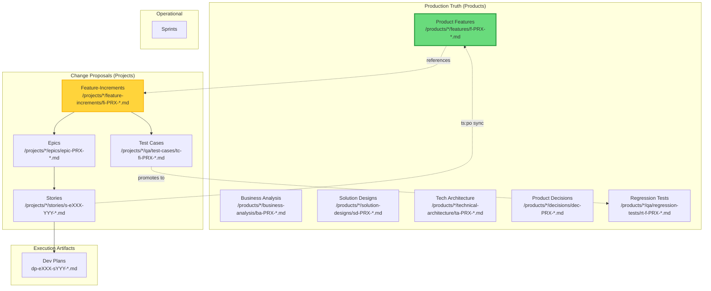

# TeamSpec 4.0 Model

> **Status:** Normative  
> **Source:** [registry.yml](registry.yml)

---

## The Product-Canon Model

TeamSpec 4.0 uses the **Product-Canon** operating model, which separates:

- **Products** — Long-lived, production-truth documentation (AS-IS state)
- **Projects** — Time-bound change initiatives that propose modifications to products (TO-BE state)

### Core Principle

```
Product Canon = Production Truth (AS-IS)
Feature-Increments = Proposed Changes (TO-BE)
Canon is updated ONLY after deployment via ts:po sync
```

---

## Document Hierarchy



---

## Canon Hierarchy

### Product Canon (Umbrella)

The complete set of production-truth documentation for a product.

**Location:** `products/{product-id}/`

**Includes:**
- `features/` — Feature Canon (behavioral truth)
- `business-analysis/` — BA artifacts
- `solution-designs/` — SA artifacts
- `technical-architecture/` — SA artifacts
- `decisions/` — Product decisions (PO)
- `qa/regression-tests/` — QA regression suite

### Feature Canon (Subset)

The behavioral subset of Product Canon — system behavior truth.

**Location:** `products/{product-id}/features/`

**Contains:** `f-PRX-NNN-*.md` files

### Feature-Increments (Project Deltas)

Project artifacts proposing changes to Product Canon.

**Location:** `projects/{project-id}/feature-increments/`

**Contains:** `fi-PRX-NNN-*.md` files with AS-IS/TO-BE sections

---

## Canon Rules

| ID | Rule |
|----|------|
| CANON-001 | Product Feature Canon is the single source of truth for AS-IS behavior |
| CANON-002 | Projects propose changes via Feature-Increments, never modify Product Canon directly |
| CANON-003 | Product Canon is updated ONLY after successful deployment (via `ts:po sync`) |
| CANON-004 | All stories must link to an Epic via filename (`s-eXXX-YYY` pattern) |
| CANON-005 | Epics define the TO-BE state for a coherent change |
| CANON-006 | Feature-Increments (`fi-PRX-XXX`) describe deltas against Product Features (`f-PRX-XXX`) |
| CANON-007 | A project can modify multiple products (many-to-many relationship) |
| CANON-008 | Business decisions affecting products are logged at product level after deployment |
| CANON-009 | Every product has a unique 3-4 character prefix (PRX) used in all artifact filenames |

---

## Invariants

These rules are **always true** in TeamSpec 4.0:

| ID | Invariant | Enforcement |
|----|-----------|-------------|
| INV-001 | Product Canon is updated ONLY after deployment | `ts:po sync` requires deployment gate passed |
| INV-002 | Every artifact has exactly one owner role | registry.yml artifacts.*.owner is singular |
| INV-003 | Stories link to Epics via filename | `s-eXXX-YYY-*.md` pattern mandatory |
| INV-004 | Feature-Increments describe AS-IS and TO-BE | Linter rule TS-FI-001 |
| INV-005 | PRX is immutable after product creation | product.yml validation |

---

## PRX (Product Prefix)

A unique 3-4 uppercase character identifier for each product.

**Rules:**
- Assigned by PO when product is created
- Must be unique across all products
- Used in ALL artifact filenames for that product
- NEVER changes after assignment

**Naming Patterns:**

| Artifact Type | Pattern | Example |
|---------------|---------|---------|
| Product artifacts | `f-PRX-XXX`, `ba-PRX-XXX`, etc. | `f-ACME-001-user-auth` |
| Project increments | `fi-PRX-XXX`, `epic-PRX-XXX`, etc. | `fi-ACME-001-oauth-login` |
| Stories | `s-eXXX-YYY-description.md` | `s-e001-042-add-google-oauth.md` |
| Dev Plans | `dp-eXXX-sYYY-tasks.md` | `dp-e001-s042-oauth-impl.md` |
