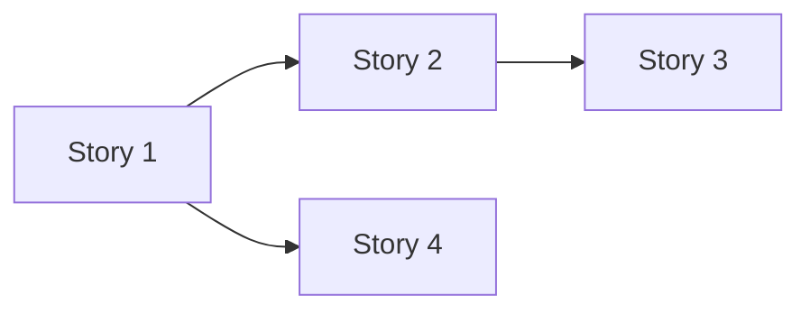

# Story Map: [Epic Name]

<!-- 
  ⚠️ STORY MAP RULES
  
  Story maps help visualize user journeys and slice features.
  
  RULES:
  1. Story candidates must link to Feature IDs
  2. Features must exist in Canon before stories are created
  3. This is a planning artifact, not source of truth
-->

> **Template Version**: 2.0  
> **Last Updated**: 2026-01-07

---

**Document Owner:** FA (Functional Analyst)  
**Artifact Type:** Planning (Workshop Output)  
**Lifecycle:** Historical after stories created

---

**Epic ID**: [EPIC-ID]  
**Created**: YYYY-MM-DD  
**Facilitator**: [Name/Role]  
**Participants**: [BA, FA, ARCH, DEV, QA names]

---

## Epic Overview

### Goal

[One-sentence statement of business value]

### Personas

| Persona | Description | Key Needs |
|---------|-------------|-----------|
| [Persona 1] | [Brief description] | [What they need] |
| [Persona 2] | [Brief description] | [What they need] |

### Constraints

- **Technical**: [Stack, platform, integrations]
- **Compliance**: [GDPR, SOX, etc.]
- **Timeline**: [MVP deadline, launch date]
- **Resources**: [Team size, skills]

### Success Metrics

| Metric | Target |
|--------|--------|
| [KPI 1] | [Target] |
| [KPI 2] | [Target] |

---

## Story Map Visualization

### Backbone (Activities)

```
┌─────────────┬─────────────┬─────────────┬─────────────┐
│  Activity 1 │  Activity 2 │  Activity 3 │  Activity 4 │
└─────────────┴─────────────┴─────────────┴─────────────┘
```

---

## User Steps by Activity

### Activity 1: [Activity Name]

**User Steps**:
1. [Step 1.1]
2. [Step 1.2]
3. [Step 1.3]

**Edge Cases**:
- [Edge case 1]
- [Edge case 2]

### Activity 2: [Activity Name]

**User Steps**:
1. [Step 2.1]
2. [Step 2.2]

**Edge Cases**:
- [Edge case 1]

---

## Feature Slices

| Slice | Priority | Goal | Features | Stories |
|-------|----------|------|----------|---------|
| [Slice 1] | MVP | [What it delivers] | F-XXX | S-001, S-002 |
| [Slice 2] | Next | [What it delivers] | F-YYY | S-003 |
| [Slice 3] | Later | [What it delivers] | F-ZZZ | TBD |

---

## Story Candidates

> ⚠️ All story candidates must link to Feature IDs.
> Features must exist in Canon before stories are created.

| Title | Slice | Feature(s) | Impact | Notes | Risks |
|-------|-------|------------|--------|-------|-------|
| [Story 1] | MVP | F-XXX | Adds | [Notes] | [Risks] |
| [Story 2] | MVP | F-XXX | Adds | [Notes] | [Risks] |
| [Story 3] | Next | F-YYY | Adds | [Notes] | [Risks] |

---

## Feature Canon Alignment

> Verify features exist before creating stories.

| Feature ID | Feature Name | Status | Stories Mapped |
|------------|--------------|--------|----------------|
| F-XXX | [Name] | Active / To Create | S-001, S-002 |
| F-YYY | [Name] | Active / To Create | S-003 |

**Features to Create**:
- [ ] F-XXX: [Feature Name] — Owner: BA
- [ ] F-YYY: [Feature Name] — Owner: BA

---

## Dependencies



---

## Risks & Mitigations

| Risk | Likelihood | Impact | Mitigation |
|------|------------|--------|------------|
| [Risk 1] | High/Med/Low | High/Med/Low | [Mitigation] |

---

## Next Steps

- [ ] BA to create missing Feature files
- [ ] FA to create stories from candidates
- [ ] Link stories to features
- [ ] Refine stories in backlog
