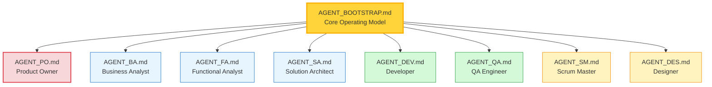

# TeamSpec 4.0 Agent Prompts

> **Version:** 4.0.1  
> **Purpose:** Predefined AI agents for TeamSpec-driven software delivery  
> **Last Updated:** 2026-01-12

---

## Overview

This folder contains agent prompt definitions for creating AI assistants that operate within the TeamSpec 4.0 Product-Canon framework. These agents can be loaded into platforms like GitHub Copilot, Claude, ChatGPT, or other AI assistants.

TeamSpec 4.0 introduces the **Product-Canon** operating model, which separates:
- **Products** — Long-lived, production-truth documentation (AS-IS state)
- **Projects** — Time-bound change initiatives that propose modifications to products (TO-BE state)

Each agent:
- Understands their role boundaries
- Enforces the Product-Canon model
- Knows when to refuse (and why)
- Can escalate to appropriate roles
- Follows quality gates

---

## LLM Search Guide

When searching for context, use these patterns:

| If you need... | Search for | File pattern |
|----------------|-----------|--------------|
| Current production behavior | Product Feature | `products/**/f-{PRX}-*.md` |
| Proposed behavior change | Feature-Increment | `projects/**/fi-{PRX}-*.md` |
| Business context & rationale | Business Analysis | `**/ba-{PRX}-*.md` |
| Technical constraints | Technical Architecture | `**/ta-{PRX}-*.md` |
| Story execution details | Story | `**/s-e*-*.md` |
| Normative rules | Registry | `spec/4.0/registry.yml` |

---

## Template Selection Guide

| I need to... | Use Template | Owner |
|--------------|--------------|-------|
| Document production behavior | `feature-template.md` | FA |
| Propose a behavior change | `feature-increment-template.md` | FA |
| Write a development task | `story-template.md` | FA |
| Group stories into a deliverable | `epic-template.md` | FA |
| Record an architecture decision | `ta-template.md` | SA |
| Track a bug | `bug-report-template.md` | QA |
| Plan a sprint | `sprint-template.md` | SM |
| Document business context | `business-analysis-template.md` | BA |

---

## Agent Architecture



All agents inherit from **AGENT_BOOTSTRAP.md** which defines:
- Product-Canon model
- Role boundary philosophy
- Escalation principles
- Quality gates

---

## Quick Reference

| Agent | Role | Primary Responsibility | Key Commands |
|-------|------|------------------------|--------------|
| [AGENT_BOOTSTRAP](./AGENT_BOOTSTRAP.md) | Core | Operating model foundation | — |
| [AGENT_PO](./AGENT_PO.md) | Product Owner | Products, Projects, Product Canon, Deployment gates | `ts:po` |
| [AGENT_BA](./AGENT_BA.md) | Business Analyst | Business Analysis artifacts, Domain knowledge | `ts:ba` |
| [AGENT_FA](./AGENT_FA.md) | Functional Analyst | Features, Feature-Increments, Epics, Stories | `ts:fa` |
| [AGENT_SA](./AGENT_SA.md) | Solution Architect | Technical design, ADRs | `ts:sa` |
| [AGENT_DEV](./AGENT_DEV.md) | Developer | Implementation, dev plans | `ts:dev` |
| [AGENT_QA](./AGENT_QA.md) | QA Engineer | Testing, validation, bug classification | `ts:qa` |
| [AGENT_SM](./AGENT_SM.md) | Scrum Master | Sprint operations, ceremonies, deployment gates | `ts:sm` |
| [AGENT_DES](./AGENT_DES.md) | Designer | UX design, design artifacts | `ts:des` |

---

## Which Agent Do I Need?

### By Question Type

| If you're asking about... | Use Agent |
|---------------------------|-----------|
| "How do I create a new product?" | PO |
| "What's in production now?" | PO |
| "Why are we building this?" | BA |
| "What should the system do?" | FA |
| "How should we build this?" | SA |
| "How do I implement this?" | DEV |
| "Does this work correctly?" | QA |
| "What's in this sprint?" | SM |
| "Is the deployment ready?" | SM |
| "What should this look like?" | DES |

### By Activity

| Activity | Agent |
|----------|-------|
| Creating a new product | PO |
| Approving deployment to production | PO |
| Syncing project changes to Product Canon | PO |
| Starting a new project | PO |
| Creating Business Analysis artifacts | BA |
| Creating Feature-Increments | FA |
| Creating Epics | FA |
| Writing user stories | FA |
| Creating ADRs | SA |
| Planning implementation | DEV |
| Writing test cases | QA |
| Running sprint planning | SM |
| Managing deployment checklists | SM |
| Creating wireframes/flows | DES |

### By Artifact

| If you're creating... | Use Agent |
|-----------------------|-----------|
| Products, product.yml | PO |
| Projects, project.yml | PO |
| Product Features (f-PRX-XXX) | FA |
| Feature-Increments (fi-PRX-XXX) | FA |
| Epics (epic-PRX-XXX), stories (s-eXXX-YYY) | FA |
| Business Analysis (ba-PRX-XXX, bai-PRX-XXX) | BA |
| ADRs (ta-PRX-XXX, tai-PRX-XXX) | SA |
| Dev plans (dp-eXXX-sYYY), code | DEV |
| Test cases, bug reports | QA |
| Sprint goals, deployment checklists, retros | SM |
| Designs, prototypes | DES |

---

## Usage Instructions

### GitHub Copilot

1. **Custom Instructions:** Copy the agent content into your GitHub Copilot custom instructions
2. **Chat:** Use the agent as context when asking questions
3. **Commands:** Use `ts:` prefixed commands for structured workflows

### Claude / ChatGPT

1. **System Prompt:** Paste the agent content as the system prompt
2. **Bootstrap First:** Always include AGENT_BOOTSTRAP.md with your chosen role agent
3. **Combine:** For best results: `AGENT_BOOTSTRAP.md + AGENT_[ROLE].md`

### Example Setup

```markdown
# System Prompt Setup

## Include Base:
[Paste contents of AGENT_BOOTSTRAP.md]

## Include Role:
[Paste contents of AGENT_FA.md]  # or whichever role you need

## Your Context:
- Working in repository: [your-repo]
- Current sprint: Sprint 5
- Active feature: F-042 User Dashboard
```

---

## Agent Capabilities Summary

### AGENT_BOOTSTRAP (Foundation)

**What it provides:**
- Product-Canon model explanation (Products vs Projects)
- Canon rules (CANON-001 to CANON-009)
- Story-as-delta philosophy
- Role boundaries
- Escalation principles (including Read-Only Mode)
- When to Ask Questions vs Refuse decision table
- Minimal Output Bias rule
- Quality gates (including Deployment Gate)
- Command structure

### AGENT_PO (Product Owner) — NEW in 4.0

**Owns:** Products, Product Canon (AS-IS state), Deployment gates  
**Creates:** Products, product.yml, Product Features (f-PRX-XXX)  
**Enforces:** Product Canon integrity, deployment approval, sync after deployment  
**Refuses:** Writing stories, defining project scope, modifying Canon during projects

### AGENT_BA (Business Analyst)

**Owns:** Projects, Feature-Increments (purpose/scope), Project Decisions  
**Creates:** Projects, BA Increments (bai-PRX-XXX), Feature-Increments (fi-PRX-XXX), SD Increments  
**Enforces:** Business rationale, value justification, product targeting  
**Refuses:** Writing stories, modifying Product Canon, creating Products

### AGENT_FA (Functional Analyst)

**Owns:** Stories, Epic behavior, Feature-Increment behavior, Canon sync proposals  
**Creates:** Epics (epic-PRX-XXX), Stories (s-eXXX-YYY), Canon sync proposals  
**Enforces:** Delta stories, Epic linking (mandatory), Canon sync preparation  
**Refuses:** Story creation without Epic link, direct Product Canon modification

### AGENT_SA (Solution Architect)

**Owns:** Technical design, technology choices, ADRs  
**Creates:** Product Tech Architecture (ta-PRX-XXX), Project ADRs (tai-PRX-XXX)  
**Enforces:** Design alignment, ADR before coding  
**Refuses:** Implementation without ADR for significant changes

### AGENT_DEV (Developer)

**Owns:** Implementation, task breakdown  
**Creates:** Dev plans (dp-eXXX-sYYY), code, commits  
**Enforces:** Plan before code, tests with implementation  
**Refuses:** Coding without dev plan, changing scope

### AGENT_QA (QA Engineer)

**Owns:** Testing, validation, quality  
**Creates:** Test cases, bug reports, UAT scripts  
**Enforces:** Bug classification, Definition of Done, tests against TO-BE state  
**Refuses:** Signing off without Canon alignment, deployment without verification

### AGENT_SM (Scrum Master)

**Owns:** Sprint operations, process facilitation, deployment gate checklist  
**Creates:** Sprint artifacts, metrics, retro outputs, deployment checklists  
**Enforces:** Sprint integrity, neutrality, process, deployment readiness  
**Refuses:** Making priority decisions (facilitates, doesn't decide)

### AGENT_DES (Designer)

**Owns:** UX design, design artifacts  
**Creates:** Feature-level designs, flows, specs  
**Enforces:** Design at feature level (not story)  
**Refuses:** Designing without clear scope or personas

---

## Key Principles

### 1. Product-Canon is Truth (AS-IS)

The Product Canon (`/products/*/features/`) is the authoritative source for production system behavior. Products represent the AS-IS state — what is currently deployed and running.

### 2. Projects Propose Changes (TO-BE)

Projects contain Feature-Increments (`/projects/*/feature-increments/`) that propose changes to products. These represent the TO-BE state — what will be after deployment.

### 3. Products and Projects are Separate

```
Products (AS-IS)                      Projects (TO-BE)
├── products/{product-id}/            ├── projects/{project-id}/
│   ├── product.yml (includes PRX)    │   ├── project.yml
│   ├── features/                     │   ├── feature-increments/
│   │   └── f-PRX-XXX-*.md            │   │   └── fi-PRX-XXX-*.md
│   └── ...                           │   └── ...
```

This prevents "time pollution" where project artifacts contaminate production documentation.

### 4. Canon Sync Only After Deployment

Product Canon is updated ONLY after successful deployment via `ts:po sync`. FA prepares sync proposals; PO executes them.

### 5. Stories Link to Epics (Mandatory)

Story filenames MUST include Epic ID: `s-eXXX-YYY-description.md`. This replaces the 2.0 feature link requirement.

### 6. Product Prefix (PRX)

Every product has a unique 3-4 character prefix (e.g., `DIT` for "DnD Initiative Tracker"). All artifact filenames include this prefix for traceability.

### 7. Strict Role Boundaries

Each agent stays in their lane. They know what they own, what they don't, and when to escalate. PO owns Products; BA owns Projects; FA owns Stories.

### 8. Quality Gates

Agents enforce Definition of Ready (before development), Definition of Done (after completion), and Deployment Gate (before Canon sync).

### 9. Escalation Over Assumption

When an agent encounters something outside their domain, they escalate to the appropriate role rather than guessing.

### 10. Minimal Output Bias

Default to the minimum output needed to progress to the next gate. Don't over-document.

---

## Command Reference

### PO Commands (`ts:po`) — NEW in 4.0

| Command | Description |
|---------|-------------|
| `ts:po product` | Create new product with PRX |
| `ts:po project` | Create project targeting product(s) |
| `ts:po status` | Product status overview |
| `ts:po approve` | Approve deployment readiness |
| `ts:po sync` | Sync project changes to Product Canon |
| `ts:po deprecate` | Mark product as deprecated |

### BA Commands (`ts:ba`)

| Command | Description |
|---------|-------------|
| `ts:ba analysis` | Create business analysis document |
| `ts:ba ba-increment` | Create BA increment (bai-PRX-XXX) |
| `ts:ba decision` | Log project decision |
| `ts:ba review` | Review BA document |

### FA Commands (`ts:fa`)

| Command | Description |
|---------|-------------|
| `ts:fa feature-increment` | Create Feature-Increment (fi-PRX-XXX) |
| `ts:fa epic` | Create Epic (epic-PRX-XXX) |
| `ts:fa story` | Create story linked to Epic (s-eXXX-YYY) |
| `ts:fa sync-prepare` | Prepare Canon sync proposal for PO |
| `ts:fa behavior` | Update Feature-Increment behavior |
| `ts:fa storymap` | Story mapping workshop |

### SA Commands (`ts:sa`)

| Command | Description |
|---------|-------------|
| `ts:sa sd` | Create Solution Design (sd-PRX-XXX) |
| `ts:sa ta` | Create Technical Architecture (ta-PRX-XXX) |
| `ts:sa review` | Review technical design |

### DEV Commands (`ts:dev`)

| Command | Description |
|---------|-------------|
| `ts:dev plan` | Create task breakdown (dp-eXXX-sYYY) |
| `ts:dev implement <id>` | Execute implementation |
| `ts:dev commit` | Generate commit message |
| `ts:dev branch <id>` | Create branch |
| `ts:dev ready <id>` | Move to ready-for-dev |

### QA Commands (`ts:qa`)

| Command | Description |
|---------|-------------|
| `ts:qa test` | Design test cases |
| `ts:qa dor-check <id>` | DoR checklist |
| `ts:qa dod-check <id>` | DoD checklist |
| `ts:qa execute` | Execute test run |

### SM Commands (`ts:sm`)

| Command | Description |
|---------|-------------|
| `ts:sm` | Open SM menu |
| `ts:sm sprint` | Create and manage sprints |
| `ts:sm sprint plan` | Sprint planning |
| `ts:sm sprint add <id>` | Add story to sprint |
| `ts:sm sprint status` | Sprint status |
| `ts:sm sprint close` | Close sprint |
| `ts:sm deploy-checklist` | Generate deployment checklist |

### Universal Commands

| Command | Description |
|---------|-------------|
| `ts:fix` | Auto-fix lint errors |
| `ts:lint` | Run linter (includes TS-PROD-*, TS-FI-*, TS-EPIC-*) |
| `ts:context` | Show/validate team context |
| `ts:deploy` | **DEPRECATED** — Use `ts:po sync` instead |
| `ts:migrate` | Migrate from older TeamSpec versions |
| `ts:agent <role>` | Load role-specific agent |

---

## Linter Rules

Agents enforce these linter rules:

| Category | Rules | Agent |
|----------|-------|-------|
| TS-PROD-* | Product validation (product.yml, PRX) | PO |
| TS-FI-* | Feature-Increment validation | BA, FA |
| TS-EPIC-* | Epic validation | FA |
| TS-PROJ-* | Project validation (product targeting) | BA |
| TS-STORY-* | Story validation (Epic linking) | FA, DEV |
| TS-ADR-* | ADR validation (ta-PRX, tai-PRX) | SA |
| TS-DEVPLAN-* | Dev plan validation (dp-eXXX-sYYY) | DEV |
| TS-QA-* | Test case validation | QA |
| TS-UAT-* | UAT validation | QA |
| TS-NAMING-* | Naming conventions (PRX patterns) | All |
| TS-DOD-* | Definition of Done (incl. Deployment Gate) | All |

---

## Troubleshooting

### Agent refuses to proceed

**Common causes:**
1. Missing prerequisite (e.g., no feature for story)
2. Role boundary violation
3. Incomplete information

**Solution:** Read the agent's refusal message - it explains what's missing and who to ask.

### Agent seems confused about context

**Solution:** Ensure you've included:
1. AGENT_BOOTSTRAP.md (always)
2. The specific role agent you need
3. Context about your repository structure

### Commands not recognized

**Solution:** Commands are `ts:<family> <subcommand>`. Check the command reference above for correct syntax.

---

## Version History

| Version | Date | Changes |
|---------|------|---------|
| 4.0 | 2026-01-09 | Product-Canon model: Products vs Projects separation, new PO role, PRX naming, Epic-mandatory stories, deployment gates |
| 2.0.1 | 2026-01-07 | Added: Feature Canon Ownership Model, delegation authority for FA, escalation-vs-blocking clarification, read-only mode, minimal output bias, cross-role contribution rights |
| 2.0 | 2026-01-07 | Initial TeamSpec agents |

---

## Contributing

To improve these agents:
1. Use `ts:feedback` to report issues
2. Propose changes via PR
3. Test with real workflows before merging
